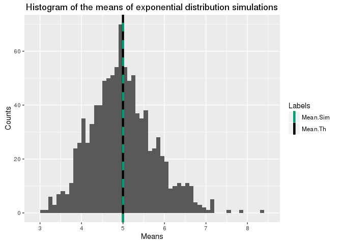

# Statistical Inference: The connection between the exponential distribution and the central limit theorem
Marc T. Henry de Frahan  
# Synopsis

# Load some libraries

```r
library(ggplot2)
```


# Setup

For the rest of this project, we set the rate parameter, lambda, to
0.2, the number of simulations, $N$, to 1000, and the number of drawings for each simulation, $n$, to 40.


```r
lambda <- 0.2
N <- 1000
n <- 40
mean_theory <- 1/lambda
var_theory <- 1/(lambda*lambda)
var_theory_means <- var_theory/n
```

Let's run 1000 simulations of the exponential distribution. Each
time we do a simulation, we save the mean to a vector of means. We
also compute the mean of the sample and the variance. We also set the seed of each drawing so we can be sure that we can exactly reproduce the results.


```r
sim_means <- NULL
for (i in 1 : 1000){
    sim_means <- c(sim_means, mean(rexp(ndraw,lambda)))
}
mean_sim <- mean(sim_means)
var_sim <- var(sim_means)
```

# Comparing the sample mean to the theoretical mean

The sample mean is 5.002327 and the theoretical mean is `r
mean_theory`. As you can see in this figure, the sample distribution
is very closely centered to the theoretical distribution.


```r
ggplot() +
    aes(sim_means) +
    geom_histogram(binwidth=0.1) +
    geom_vline(aes(xintercept=mean_theory, colour="Mean.Th", linetype = "Mean.Th"),
               size = 1.5) +
    geom_vline(aes(xintercept=mean_sim_means, colour="Mean.Sim", linetype = "Mean.Sim"),
               size = 1.5, show.legend=TRUE) +
    scale_colour_manual(name="Labels", values=c(Mean.Sim="#009E73",Mean.Th="black")) +
    scale_linetype_manual(name="Labels", values=c(Mean.Sim="dashed",Mean.Th="solid"), guide=FALSE)+
    labs(x = "Means",
         y = "Counts",
         title = "Histogram of the means of exponential distribution simulations")
```




# Comparing the sample variance to the theoretical variance

The sample variance is 0.6308244 and the theoretical variance
is 0.625. As you can see in this figure, which is
identical to the previous one with the expected normal distribution
contour, the distribution of the means follows a normal distribution $ N(\mu, \frac{sigma}{\sqrt{n}})$ 

